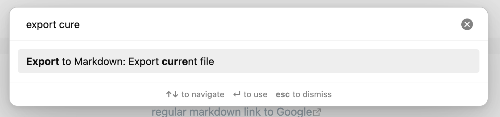

# Obsidian Export to Markdown Plugin

Markdown files stored within [Obsidian](https://obsidian.md/) are surprisingly hard to share with other people when they include images (or other attachments):
- you need to figure out all the attachments that file references to include them alongside the file
- you need to change the link format from Obsidian's WikiLink-style format (`![[image]]`) to the standard markdown format (``)

This Obsidian plugin provides a new command that solves both of these problems, allowing you (for instance) to share a Markdown file from you vault through [Github Gist](https://gist.github.com/).



## Installation

I did not submit this plugin to the official list of plugins.

To install it, you need to clone this repository within your Vault's `.obsidian/plugins/` folder and build it locally (see next section).

## Local development

- using the right Node.js version: `nvm use`
- installing dependencies: `yarn`
- running unit tests: `yarn run test`
  - update unit test snapshots: `yarn run test -- -u`
- build plugin (minified build): `yarn run build`
- build plugin (development build with auto-rebuild): `yarn run dev`
  
  (you then need to reload Obsidian or disable and enable the plugin to load the new version)

## How does it work?

When you run the command, the extension will:
- parse the Markdown file you want to export to an AST
- find all links that reference local files
- copy those local files to the export location
- update those links' targets in the AST so that they reference the new copied files
- render the updated AST into Markdown and write that it to the export location

### Caveats

#### Unwanted differences between original file and exported file

Ideally, we would want the exported file to be identical to the original file (with the exception of the updated attachment links).

The main caveat of the above approach (markdown -> AST -> updated AST -> markdown), is that, depending on how the Markdown <-> AST conversions are implemented, it may not be able to provide that.

For instance, in Markdown, there are multiple ways of writing an `h1` title:

```markdown
# This is an h1 title

This is also an h1 title
========================
```

If the AST we are working with only knows that the title is an `h1` title, but not how that `h1` title was formatted in the original file, we have to make an arbitrary choice between those two formats when rendering the AST to Markdown.

Note that the exported file should be semantically equivalent to the original.

#### Cannot use Obsidian's internal parsing library

Unfortunately, Obsidian doesn't expose its internal Markdown parser, so we have to use another one, that may not have the same semantics.

The only one I found that supported Obsidian-style WikiLinks was unified, using remark and the [`@portaljs/remark-wiki-link`](https://github.com/datopian/portaljs/tree/8a4ec39d25d10a859dc7ed3e3a578882a63cc95a/packages/remark-wiki-link) plugin.  
(the [`remark-wiki-link`](https://github.com/landakram/remark-wiki-link) plugin doesn't support `![[Link]]`-style links for images)

However, `@portaljs/remark-wiki-link` isn't compatible with the latest versions of `mdast-util-from-markdown` (used under the hood by unified / remark for parsing markdown).  
To "fix" the problem without getting into a state where some package versions are incompatible with each other, I locked all unified / remark-related packages to their previous major versions.  
Someone suggested a more permanent fix in [this issue](https://github.com/datopian/portaljs/issues/1059).

## Unit testing with Jest

Lost a bunch of time getting Jest to work because unified (and all the related packages) moved to using ES modules in their releases.

Here are some useful links:
- why I couldn't use the latest stable Node version: https://github.com/nodejs/node/issues/59480
- https://gist.github.com/sindresorhus/a39789f98801d908bbc7ff3ecc99d99c
- https://jestjs.io/docs/configuration

---
# Original `README.md` from [obsidian-sample-plugin](https://github.com/obsidianmd/obsidian-sample-plugin) repository

This is a sample plugin for Obsidian (https://obsidian.md).

This project uses TypeScript to provide type checking and documentation.
The repo depends on the latest plugin API (obsidian.d.ts) in TypeScript Definition format, which contains TSDoc comments describing what it does.

This sample plugin demonstrates some of the basic functionality the plugin API can do.
- Adds a ribbon icon, which shows a Notice when clicked.
- Adds a command "Open Sample Modal" which opens a Modal.
- Adds a plugin setting tab to the settings page.
- Registers a global click event and output 'click' to the console.
- Registers a global interval which logs 'setInterval' to the console.

## First time developing plugins?

Quick starting guide for new plugin devs:

- Check if [someone already developed a plugin for what you want](https://obsidian.md/plugins)! There might be an existing plugin similar enough that you can partner up with.
- Make a copy of this repo as a template with the "Use this template" button (login to GitHub if you don't see it).
- Clone your repo to a local development folder. For convenience, you can place this folder in your `.obsidian/plugins/your-plugin-name` folder.
- Install NodeJS, then run `npm i` in the command line under your repo folder.
- Run `npm run dev` to compile your plugin from `main.ts` to `main.js`.
- Make changes to `main.ts` (or create new `.ts` files). Those changes should be automatically compiled into `main.js`.
- Reload Obsidian to load the new version of your plugin.
- Enable plugin in settings window.
- For updates to the Obsidian API run `npm update` in the command line under your repo folder.

## Releasing new releases

- Update your `manifest.json` with your new version number, such as `1.0.1`, and the minimum Obsidian version required for your latest release.
- Update your `versions.json` file with `"new-plugin-version": "minimum-obsidian-version"` so older versions of Obsidian can download an older version of your plugin that's compatible.
- Create new GitHub release using your new version number as the "Tag version". Use the exact version number, don't include a prefix `v`. See here for an example: https://github.com/obsidianmd/obsidian-sample-plugin/releases
- Upload the files `manifest.json`, `main.js`, `styles.css` as binary attachments. Note: The manifest.json file must be in two places, first the root path of your repository and also in the release.
- Publish the release.

> You can simplify the version bump process by running `npm version patch`, `npm version minor` or `npm version major` after updating `minAppVersion` manually in `manifest.json`.
> The command will bump version in `manifest.json` and `package.json`, and add the entry for the new version to `versions.json`

## Adding your plugin to the community plugin list

- Check the [plugin guidelines](https://docs.obsidian.md/Plugins/Releasing/Plugin+guidelines).
- Publish an initial version.
- Make sure you have a `README.md` file in the root of your repo.
- Make a pull request at https://github.com/obsidianmd/obsidian-releases to add your plugin.

## How to use

- Clone this repo.
- Make sure your NodeJS is at least v16 (`node --version`).
- `npm i` or `yarn` to install dependencies.
- `npm run dev` to start compilation in watch mode.

## Manually installing the plugin

- Copy over `main.js`, `styles.css`, `manifest.json` to your vault `VaultFolder/.obsidian/plugins/your-plugin-id/`.

## Improve code quality with eslint (optional)
- [ESLint](https://eslint.org/) is a tool that analyzes your code to quickly find problems. You can run ESLint against your plugin to find common bugs and ways to improve your code. 
- To use eslint with this project, make sure to install eslint from terminal:
  - `npm install -g eslint`
- To use eslint to analyze this project use this command:
  - `eslint main.ts`
  - eslint will then create a report with suggestions for code improvement by file and line number.
- If your source code is in a folder, such as `src`, you can use eslint with this command to analyze all files in that folder:
  - `eslint .\src\`

## Funding URL

You can include funding URLs where people who use your plugin can financially support it.

The simple way is to set the `fundingUrl` field to your link in your `manifest.json` file:

```json
{
    "fundingUrl": "https://buymeacoffee.com"
}
```

If you have multiple URLs, you can also do:

```json
{
    "fundingUrl": {
        "Buy Me a Coffee": "https://buymeacoffee.com",
        "GitHub Sponsor": "https://github.com/sponsors",
        "Patreon": "https://www.patreon.com/"
    }
}
```

## API Documentation

See https://github.com/obsidianmd/obsidian-api
